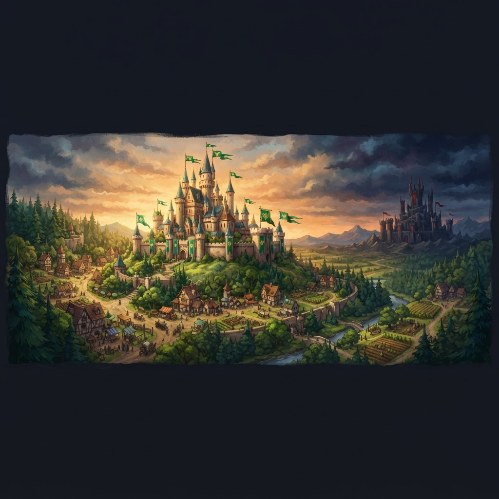
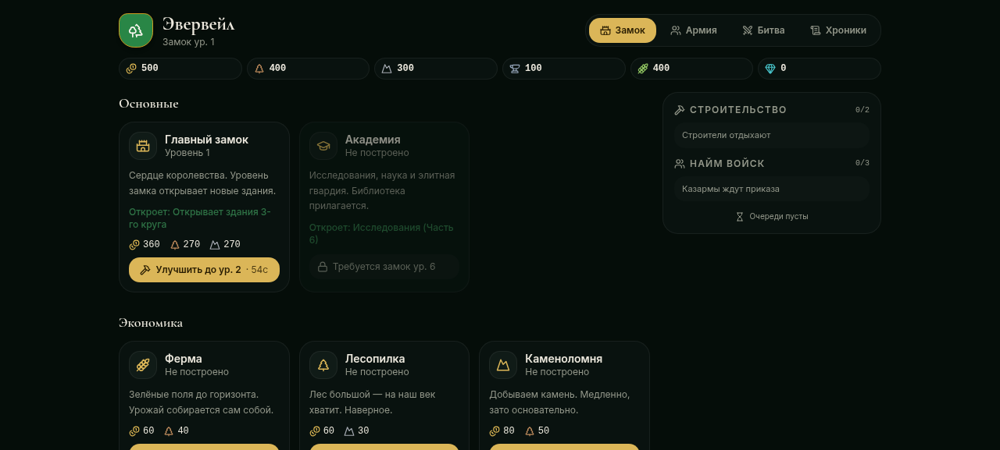
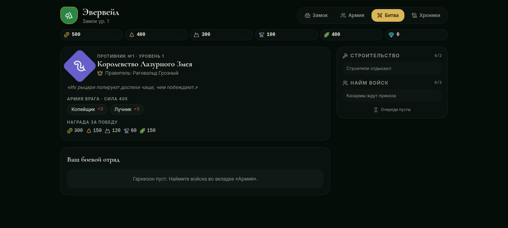

<div align="center">



# Королевство Эвервейл

**Сказочная стратегия о строительстве королевства, работающая прямо в браузере.**

Стройте замок, развивайте экономику, нанимайте армию и побеждайте бесконечную череду процедурно сгенерированных вражеских королевств.

[English](README.md) · [Русский](README.ru.md)

[](https://nextjs.org)
[](https://react.dev)
[](https://www.typescriptlang.org)
[](https://tailwindcss.com)
[](https://zustand.docs.pmnd.rs)
[](LICENSE)
[](CONTRIBUTING.md)

</div>

---

## Скриншоты

| Замок и экономика | Битва |
| :---: | :---: |
|  |  |

## Возможности

- **17 зданий** в 4 категориях — основные, экономика, военные и оборона. У каждого несколько уровней с ценой, временем строительства и открытиями, привязанными к уровню Главного замка
- **12 типов юнитов** — пехота, стрелки, кавалерия, осадные машины, магия и элита. У каждого — HP, атака, броня, скорость, дальность и уникальные способности
- **Детерминированная симуляция боя** — пошаговые раунды с сидом от состава армий и номера врага: результат нельзя «перекрутить» перезапуском анимации
- **Процедурный генератор врагов** — бесконечная череда королевств с уникальными названиями, правителями, гербами, чертами (агрессивные, укреплённые, богатые, быстрые, магические, орда), стилями замков и описаниями
- **6 ресурсов** — золото, дерево, камень, железо, еда и кристаллы с производством в минуту и лимитами хранения
- **Очереди строительства и найма** с отменой и возвратом, а также **оффлайн-прогресс** — экономика работает, пока вы отсутствуете
- **Геральдика** — настраиваемые гербы (форма, символ, цвета) для вашего королевства и каждого врага
- **Промокоды** — хранятся только в виде хэшей, а не открытым текстом (попробуйте `WELCOME2026` для быстрого старта)
- **Хроники** — история битв и статистика за всё время
- **Сохранения** через `zustand/persist` с версионированием схемы

## Быстрый старт

### Требования

- [Node.js](https://nodejs.org) 20+
- [pnpm](https://pnpm.io) 9+

### Установка

```bash
git clone https://github.com/HumSaw/evervale-kingdom.git
cd evervale-kingdom
pnpm install
pnpm dev
```

Откройте [http://localhost:3000](http://localhost:3000) и начинайте строить своё королевство.

### Скрипты

| Команда | Описание |
| --- | --- |
| `pnpm dev` | Запуск сервера разработки |
| `pnpm build` | Продакшн-сборка |
| `pnpm start` | Запуск продакшн-сборки |
| `pnpm typecheck` | Проверка типов TypeScript |

## Архитектура

Игра полностью клиентская, с чётким разделением данных, систем, состояния и UI:

```
evervale-kingdom/
├── app/                    # Next.js App Router (layout, страница, глобальные стили)
├── components/
│   ├── game/               # UI игры: shell, панели, карточки, ресурсы, гербы
│   └── ui/                 # Базовые UI-примитивы (shadcn)
└── lib/
    ├── types.ts            # Единственный источник правды для всех типов игры
    ├── store.ts            # Zustand-стор: состояние, действия, сохранения, тик
    ├── data/               # Статические определения: здания, юниты, ресурсы
    ├── systems/            # Чистая игровая логика:
    │   ├── economy.ts      #   производство, лимиты хранения, стоимость
    │   ├── battle.ts       #   детерминированная пошаговая симуляция боя
    │   ├── enemy-generator.ts  # сидированная генерация вражеских королевств
    │   └── promo.ts        #   реестр промокодов по хэшам
    ├── format.ts           # Форматирование чисел и времени
    └── icon-map.ts         # Маппинг иконок Lucide
```

**Принципы дизайна:**

- `lib/systems/` — чистые функции без привязки к фреймворку: легко тестировать и понимать
- Вся случайность сидирована (PRNG mulberry32): враги и бои воспроизводимы
- Итог боя вычисляется мгновенно и авторитетно; анимация лишь воспроизводит уже свершившееся
- Состояние игры версионируется (`schemaVersion`) для безопасных миграций сохранений

## Технологии

| Слой | Технология |
| --- | --- |
| Фреймворк | [Next.js 16](https://nextjs.org) (App Router) + [React 19](https://react.dev) |
| Язык | [TypeScript 5.7](https://www.typescriptlang.org) (strict) |
| Состояние | [Zustand 5](https://zustand.docs.pmnd.rs) с middleware `persist` |
| Стили | [Tailwind CSS 4](https://tailwindcss.com) + [shadcn/ui](https://ui.shadcn.com) |
| Анимация | [Motion](https://motion.dev) |
| Иконки | [Lucide](https://lucide.dev) |

## Планы

- [ ] Дерево исследований (Академия) — типы уже заложены в `ResearchState`
- [ ] Больше способностей юнитов, влияющих на симуляцию боя
- [ ] Звуковые эффекты и музыка
- [ ] Локализация (сейчас интерфейс игры на русском)
- [ ] Серверная проверка промокодов для мультиплеера

## Участие в разработке

Мы рады вкладу! Прочитайте [руководство по контрибуции](CONTRIBUTING.md) перед созданием issue или pull request.

## Лицензия

Распространяется под лицензией [MIT](LICENSE).

---

<div align="center">
Сделано с ❤️ в <a href="https://v0.app">v0</a>
</div>
